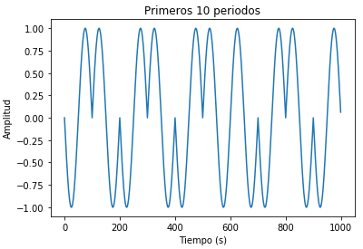
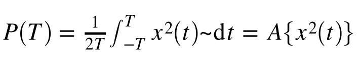
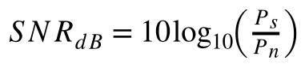
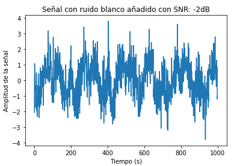
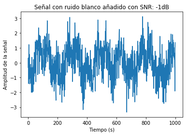
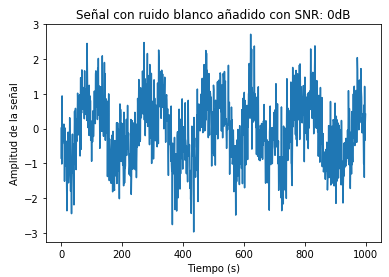
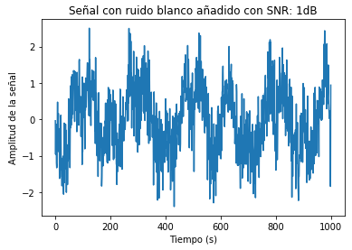
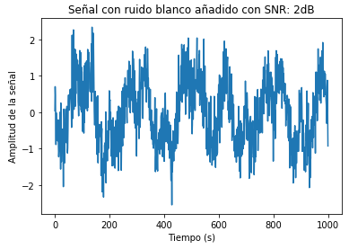
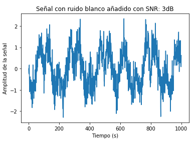

# Tarea4
### Parte #1: Crear un esquema de modulación BPSK para los bits presentados. Esto implica asignar una forma de onda sinusoidal normalizada (amplitud unitaria) para cada bit y luego una concatenación de todas estas formas de onda.

La modulación por desplazamiento de fase, conocida como BPSK es una modulación angular que varia la fase portadora entre un número determinado de valores discretos.
Se toman datos codificados en binario y los modula en forma de señales sinusoidales.Esta señal moduladora es una señal digital con un número de estados limitado.
En caso que el dato codificado sea 1, esto significa que la señal es sinosoidal sin desfase, en caso que el dato sea 0, la señal tendrá forma de un seno desplazado 90°.

El enunciado en este caso presenta un archivo con 10 mil datos codificados en binario y se solicita realizar una modulación BPSK. Se utilizó la libreria pandas para
importar los datos del documento externo. Se utilizó una frecuencia de 5000hz,se utilizaron 100 puntos de muestreo por periodo, por ende la frecuencia de muestreo que 
en este caso es la frecuencia de Nyquist equivale a 500kHz. Con esos datos, se creo un método el cual produce que si se encuentra un 1 se asigna un seno y en caso
contrario se asigna un seno negativo que equivale a un seno desplazado 90°. 

La señal modulada obtenida es:

### Parte #2:Calcular la potencia promedio de la señal modulada generada

La potencia promedio se puede ver como:

Por ende para calcuar la integral de la señal al cuadrado, dividida entre el doble de tiempo fue necesario utilizar la función integrate.trapz. Como resultado se 
obtuvo la potencia promedio de pp=0.49999999999999983

### Parte #3:Simular un canal ruidoso del tipo AWGN (ruido aditivo blanco gaussiano) con una relación señal a ruido (SNR) desde -2 hasta 3 d3.
Primeramente se tiene que la relación señal-a-ruido esta dada por:

Para simular un canal ruidoso desconocido, primeramente se utilizó esta relación de señal-a-ruido en cunjunto con la potencia promedio que se había obtenido en la parte anterior,ya que así se pudo obtener el parámetro de potencia del ruido para SNR. Con esta potencia se pudo obtener sigma mediante la función de numpy de np.sqrt. Se calculó el ruidp para -2dB, -1dB, 0dB, 1dB, 2dB y 3dB, cabe mencionar que dicho ruido se realizó mediante valores aleatorios con una distribucion normal. Se creó la señal Rx la cual es la suma de la señal modulada obtenida en la primera parte con el ruido obtenida en esta sección. 

Gráficando las señales para las distintas frecuencias en decibeles se obtiene:

### Parte #4: Graficar la densidad espectral de potencia de la señal con el método de Welch (SciPy), antes y después del canal ruidoso.
